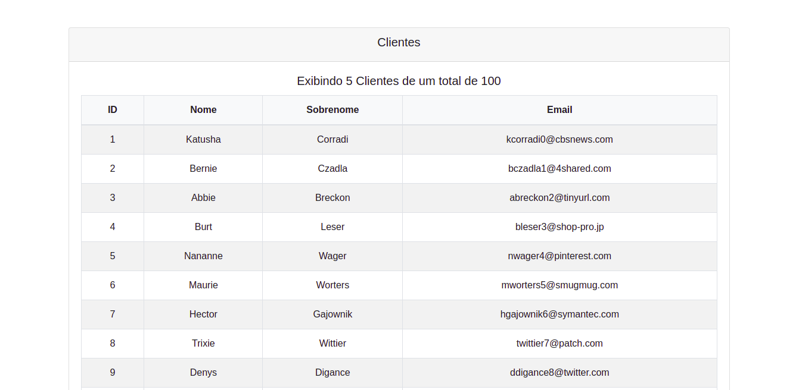

# Paginação com Laravel

Este projeto consiste em demonstrar o desenvolvimento de um sistema de paginação usando Laravel. Primeiramente, é feito usando os métodos paginate() e links(), nativos do Laravel.
Depois disso, é utilizado o sistema de paginação com JavaScript e Ajax, deixando o resultado final mais agradável para o usuário.

